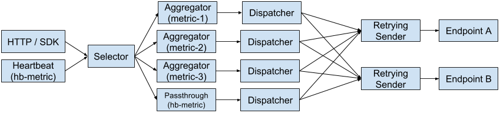

# Design

## Reporting Pipeline

Behind the small HTTP interface is a pipeline constructed based on the agent's
configuration. The following diagram shows a basic pipeline consisting of:
* 3 aggregated metrics
* a passthrough metric
* 2 endpoints
* a heartbeat source



#### Sources

Metric values can be reported to the agent via its HTTP interface or SDK API,
or they can originate from one of the agent's built-in sources, such as a
heartbeat. All metric values, including those from built-in sources, enter
the pipeline at the same place and are subject to the same aggregation
configuration.

#### Metric value buffering

Metrics can (and in most cases should) be defined with an aggregation period.
If a metric is defined as `passthrough`, reports that the agent receives are
sent directly to configured endpoints. Possible use cases for a `passthrough`
metric are when the reporting process is handling buffering itself, such as
a `heartbeat` source with a reasonable `intervalSeconds` value.

#### Aggregator

An `Aggregator` accepts usage reports in the form of a `MetricReport`.
Reports contain a name, a value, a start and end time that indicate when the
usage occurred, and an optional set of labels to be included with the report
(the agent does not use these labels itself).

The Aggregator will ultimately send these reports down the pipeline, but before
doing so it aggregates them for a period of time defined in configuration. Two
reports can be aggregated if they contain the same metric type (by name) and
they contain the same set of labels (or no labels). If two reports cannot be
aggregated, they will be stored separately.

The result of aggregating reports A and B into report C is that:
* C's metric value is the sum of values in A and B
* C's set of labels is equal to the sets in both A and B (aggregation does not
  affect labels)
* C's start time is equal to A's start time and its end time is equal to B's
  end time, indicating that it covers the range of both A and B.

The Aggregator will refuse to accept a report if:
* the report's name does not match one of the configured metric name
* the report's value type does not match the configured value type
* the report's start time is less than the most recently accepted report's
  end time

Enforcing that time ranges of two reports never overlap prevents a single usage
report from being counted twice (e.g., if the reporting software experienced a
partial failure and retried its report operation).

When the aggregation period elapses, Aggregator collects all of its aggregated
reports into a `StampedMetricReport` and sends the batch down the pipeline.
Each `StampedMetricReport` is given a unique identifier used to track its
progress through the rest of the pipeline.

#### Dispatcher

The `Dispatcher` serves as a simple fanout mechanism, sending batches down
pipeline branches towards one or more endpoints.

#### RetryingSender

A `RetryingSender` manages a queue of `EndpointReport` objects to be sent to
an endpoint. It takes care of retrying in the event of an endpoint failure,
applying exponential backoff. In the event that a report cannot be sent for
an extended period of time, it will be considered a failure.

#### Endpoint

An `Endpoint` represents a remote reporting service, such as Google Service
Control. The Endpoint component has two roles:
* It builds `EndpointReport` objects from `StampedMetricReport` objects. An
EndpointReport includes optional endpoint-specific metadata.
* It sends `EndpointReport` objects to a remote service.

Some endpoints, e.g. Google Service Control, require each report to have a
unique identifier that serves as a deduplication mechanism. By splitting the
build and send operations, an `Endpoint` can generate this identifier during
the build phase such that it remains the same across multiple retries.

## Status

The agent tracks the success or failure of each `StampedMetricReport` after
leaving the `Aggregator`. A report is considered to be successfully sent if
and only if each of the configured endpoints successfully sends it. The agent
offers this status via the /status HTTP resource:

```
curl http://localhost:3456/status
{
  "lastReportSuccess": "2017-10-04T10:06:15.820953439-07:00",
  "currentFailureCount": 0,
  "totalFailureCount": 0
}
```

In this representation:
* `lastReportSuccess` refers to the last time at which a report was successfully
  sent to all endpoints
* `currentFailureCount` is the number of failures since the last success
* `totalFailureCount` is the number of failures since the agent restarted

Software can monitor these values and act accordingly. For example, software might
warn a user or limit functionality.

## State

Some of the components described above persist state across restarts. The
`Aggregator` stores aggregated but not-yet-sent reports, and each
`RetryingSender` stores its queue of `EndpointReport` objects to send. If the
agent is launched with the `--state-dir` parameter, this state will be stored
as a series of JSON files on disk.

